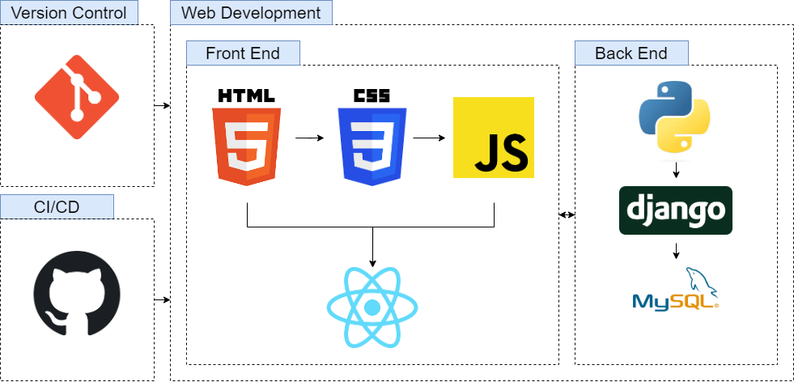

<!-- 

  

<h3 align="center" font-size:3em; >CodeCrafts Web Development Bootcamp</h3>

  -->

# Contents
- Introduction
- How to take this course
- Curriculum
- FAQ
- Code of Conduct
- Team

# Introduction

### Overview

Welcome to our web development bootcamp! Over the next 12 weeks, you will learn the essential tools and technologies to start building your own web applications. The curriculum is designed to give you a solid foundation in the key areas of web development, including Git for version control, HTML, CSS, JavaScript and React as the front-end development, Python, Django and Databases for the backend development and finally, Github Actions for continuous integration and deployment. Each week will build upon the previous one, with two milestones along the way to test your skills and apply what you've learned. By the end of the bootcamp, you will have the skills to create your own projects and the confidence to start your journey as a web developer. Let's get started!

### Prerequisites

This course is designed to be accessible to anyone with an interest in web development, regardless of prior experience. Therefore, there are no prerequisites required for enrollment. Whether you are a complete beginner or have some experience with coding, you will find the course content to be engaging and challenging at the same time. Our goal is to provide you with a comprehensive introduction to web development and guide you through the process of creating your own web applications. We look forward to welcoming you to the class and helping you achieve your goals.

### Technologies

This course will cover several different technologies, including:

- Git: a version control system that will help you manage your code and collaborate with other developers
- HTML/CSS: the languages used to create the structure and design of web pages
- JavaScript: a programming language that allows you to create interactive and dynamic web applications
- React: a JavaScript library for building user interfaces
- Python: a versatile programming language that is commonly used for web development, data analysis, and machine learning
- Django: a web framework for Python that makes it easy to build and maintain web applications
- Databases: how to store and retrieve data, using SQLite and PostgreSQL.
- GitHub Actions: how to set up a continuous integration and continuous deployment environment for your website.

 

 

### Architectural Diagram

  

# How to take this course

### Cohort

The course is designed to be taken as a cohort, which means that you will be learning alongside other students and have the opportunity to collaborate and learn from each other. We have scheduled class times and activities that are designed to help you stay on track and make the most of your learning experience. Additionally, we will be communicating via a discord server called codecrafts_ for class discussions, activities and support.

### Self-paced

If you are unable to attend the cohort or prefer to learn at your own pace, the course is also available as a self-paced option. You will have access to all the same course materials and resources, but you will be able to work through the curriculum at your own speed. We recommend setting a schedule for yourself to ensure that you stay on track and make progress.

### Community

Regardless of whether you choose to take the course as a cohort or self-paced, you will be part of a community of students and instructors who are all working towards the same goal. We encourage you to participate in class discussions and activities via the discord server called codecrafts_, and to reach out to your classmates and instructors for support when you need it. Additionally, we also have a slack group for the students to communicate and share the knowledge.

# Curriculum

- [Week 0: Introduction](#week-0)
- [Week 1: Git](#week-1)
- [Week 2: HTML/CSS](#week-2)
- [Week 3: JavaScript](#week-3)
- [Week 4: Milestone 1 - HTML/CSS/JS Project](#week-4)
- [Week 5: React](#week-5)
- [Week 6: Milestone 2 - React Project](#week-6)
- [Week 7: Python](#week-7)
- [Week 8: Django](#week-8)
- [Week 9: Databases](#week-9)
- [Week 10: Front End/Back End Integration](#week-10)
- [Week 11: CI/CD with GitHub Actions](#week-11)
- [Week 12: Final Project](#week-12)

---

### [Week 0: Introduction](week_00_introduction/)
- Learn about the course overview, objectives, and expectations
- Introduction to the tools and resources used throughout the course

### [Week 1: Git](week_01_git/)
- Learn about version control and the basics of Git
- Learn how to create and manage repositories
- Learn how to make commits and work with branches

### [Week 2: HTML/CSS](week_02_html_css/)
- Learn about the basics of HTML and CSS
- Learn how to create and structure web pages
- Learn how to use CSS to style web pages

### [Week 3: JavaScript](week_03_javascript/)
- Introduction to the basics of JavaScript
- Learn about variables, data types, control flow, and functions

### [Week 4: Milestone 1 - HTML/CSS/JS Project](week_04_milestone_1/)
- Work on a project using HTML, CSS and JavaScript
- Learn how to build a complete web application using these technologies

### [Week 5: React](week_05_react/)
- Learn about React, a popular JavaScript library for building user interfaces
- Learn how to create reusable components
- Learn how to manage state and props and work with hooks

### [Week 6: Milestone 2 - React Project](week_06_milestone_2/)
- Work on a project using React
- Learn how to build a complete web application using React and the skills learned

### [Week 7: Python](week_07_python/)
- Introduction to the Python programming language
- Learn about variables, data types, control flow, and functions

### [Week 8: Django](week_08_django/)
- Learn about Django, a popular web framework for building web applications in Python
- Learn how to create views, models, and templates
- Learn how to handle forms and authentication

### [Week 9: Databases](week_09_databses/)
- Learn about databases and how they are used in web applications
- Learn how to interact with databases using SQL
- Learn how to use Django's built-in database models

### [Week 10: Front End/Back End Integration](week_10_frontend_backend_integration/)
- Learn how to integrate the front end and back end of a web application
- Learn about RESTful API
- Learn how to make requests to the server

### [Week 11: CI/CD with GitHub Actions](week_11_cicd_github_actions/)
- Learn about continuous integration and continuous deployment with GitHub Actions
- Learn how to set up a workflow to automate the testing and deployment of code

### [Week 12: Final Project](week_12_final_project/)
- Work on a final project
- Apply skills and knowledge learned throughout the course to create a complete web application
- Present the project to the class and receive feedback

# FAQ

- How long will the course take to complete?
The course is 12 weeks long and requires a significant time investment from students. The exact duration of the course will depend on your own schedule and pace of learning, but we recommend setting aside at least 10-15 hours per week for coursework.

- Is there any prerequisite for the course?
No, there are no prerequisites for the course. The course is designed to be accessible to anyone with an interest in web development.

- What will I learn in this course?
You will learn the essential tools and technologies to start building your own web applications. Topics covered include Git, HTML/CSS, JavaScript, React, Python, Django, databases, and deployment.

- Will I get a certificate of completion at the end of the course?
Yes, upon successful completion of the course, you will receive a certificate of completion.

# Code of Conduct

As a participant in this course, you are expected to behave in a professional and respectful manner at all times. This includes treating your classmates and instructors with respect, and refraining from any form of harassment or discrimination.

# Team

The course is taught by a team of experienced web developers and instructors who have a passion for teaching and helping others learn. Our instructors have a wealth of industry experience and are dedicated to helping you achieve your goals.
