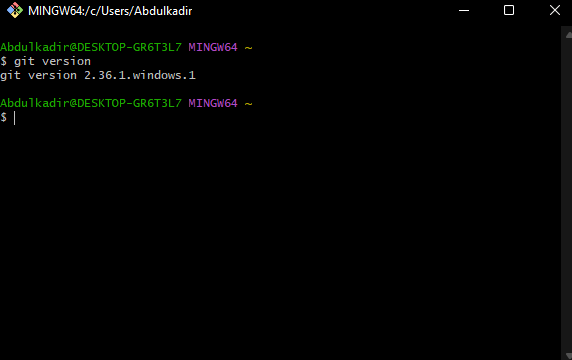
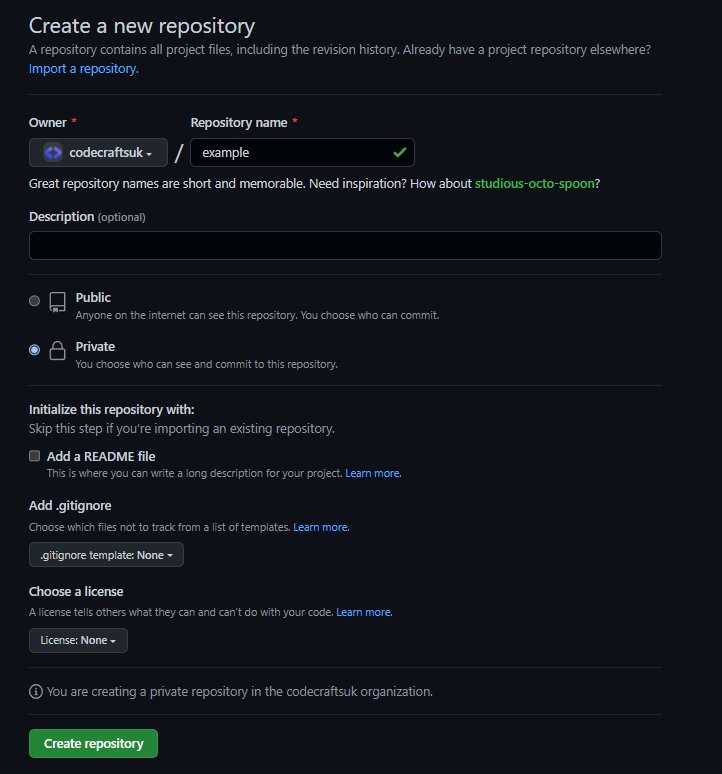

# 1. Introduction to GitHub and Git

## 1.1 What is GitHub and Git

GitHub is a web-based platform that uses Git, a distributed version control system, to manage and store code. Git allows developers to track changes to their code and collaborate with others on the same codebase. GitHub provides a user-friendly interface for developers to access and manage their Git repositories, as well as additional features like bug tracking, project management, and code review. In short, Git is the tool that powers version control, and GitHub is a platform built on top of Git that adds collaboration features and more. The difference in the way that they are used is that Git is a command-line tool whereas GitHub has a user-interface (www.github.com) that makes it more user friendly.

## 1.2 Version Control

Version control is vital for managing software development projects. Being able to track changes to code allows developers to:

- Centralise all code changes and additions to one code repository
- Allow for simple and effective collaboration within development teams
- Control the integration of new code into the codebase
- Track changes from the entire team over the full lifetime of the project
- Revert code back to previous versions
- Create code branches so that additions are made in isolation from stable code e.g. features are added in a test branch and then merged into the production branch that may be running the application
- Integrate with CI/CD automation tools such that code will be built and tested as it is generated and pushed to the repository automatically

## 1.3 Repository

In Git, a repository (or "repo" for short) is a directory that contains all the files and metadata associated with a project. This includes both the current version of the project's files and the entire history of changes to those files. The repository is the fundamental unit in Git, as all version control operations, such as committing changes and branching, are performed on the repository. Each repository has a unique identifier, called a hash, that is generated based on the contents of the repository. A repository can be stored locally on a developer's machine or remotely on a server, such as GitHub. Developers can also clone a remote repository to create a local copy of it on their machine and make changes to it.


## 1.4 Branching

Branching in Git allows developers to work on multiple versions of a project at the same time. A branch is a pointer to a specific commit in the repository's history, and it allows developers to make changes to the codebase without affecting the main branch (usually called "master").

For example, when working on a new feature, a developer can create a new branch from the current state of the master branch and make changes to that branch without affecting the code on the master branch. Once the feature is complete, the developer can then merge the changes from the feature branch back into the master branch. This way, the master branch always contains the most stable and tested version of the code.

Git also allows multiple developers to work on the same branch simultaneously. In this case, Git will automatically try to merge the changes when one developer pushes their changes to the remote repository. If there are conflicts, the developers will have to resolve them manually.

Branching also enables developers to experiment with new ideas and to isolate the changes, if they don't work out, it can be discarded without affecting the main codebase.


## 1.5 Code Tracking

Code tracking allows development teams to keep track of all changes made to a project over time. This allows for greater organisation, as all additions to code are fully documented and attributed to the developer who made them.


# 2. Set-up

## 2.1 Making a GitHub Account

1. Go to the GitHub website (https://github.com/)
2. Click on the "Sign up" button in the top right corner of the page.
3. Fill out the required fields (username, email, password) and click on the "Sign up for GitHub" button.
5. Verify your email address by clicking on the link sent to the email address you provided.

Once your email is verified, you can start creating repositories, contributing to other projects, and collaborating with others on GitHub.

## 2.2 Installing Git Bash

1. Go to the Git website (https://git-scm.com/) and download the version of Git Bash appropriate for your operating system by following the instructions on the page.

If you are on Windows, you should download GitBash. On MacOS, downloading git should suffice as terminal can be used to access git. 

After downloading Git Bash, you can open up the application and should look like the following:


On MacOS, if you simply search for the terminal by pressing the `cmd` key and the space bar key simultaneously and typing terminal, you can open up your command line and it should look like the following:


2. To check if Git has been succesfully downloaded, you can run the command `git version` as follows:

```bash
git version
```



If you can see a version, then it has been installed successfully.

For more instructions, check out the video on this topic and follow the step by step instructions set out.

## 2.3 Configuring Git

Before you can commit changes to the repository you need to have your username and email configured.

This can either be set in the scope of the repository you downloaded or set globally, so that it does not need to be configured for any other repository that you clone.

The information that you enter will get tied to the commit and this task doesn’t need to be repeated every time you want to make a commit. This can be done as follows:

```bash
git config --global user.name "Your Name"
git config --global user.email "your_email@example.com
```
where your email address is the email you used to create your github account.

Again, you need to do this only once if you pass the --global option, because then Git will always use that information for anything you do on that system. If you want to override this with a different name or email address for specific projects, you can run the command without the --global option when you're in that project.

In order to push local changes on a repository (work done via Git Bash/Terminal) to its remote counterpart (corresponding GitHub repository), you would usually have to enter your GitHub credentials to ensure you are interacting with the correct repository.

Previous versions of Git required users to enter their username and password for every Git action performed which was not ideal.

To avoid having to enter credentials every time, there are many ways but in this case we will use the most up to date version i.e. Personal Access Tokens.

settings > developer settings > personal access tokens > tokens(classic) > generate new token > copy token > paste it as the password next time you push your code when it asks for credentials

note: github password authentication is shutting down

`FIX THIS PART`

## 2.4 Making a repository

To create a repository on GitHub, follow these steps:

1. Log in to your GitHub account.

2. Click the plus icon in the top right corner of the screen and select "New repository" from the drop-down menu.

3. Enter a name for your repository, and a brief description (optional).

4. Choose whether you want your repository to be public or private. Public repositories are visible to anyone, while private repositories are only visible to you and the people you invite to collaborate.

5. Click the "Create repository" button.



Once you have created the repo, you should come across the following page:


Your repository is now remote on GitHub, but to access it locally on your machine, you would have to clone your repository which will be discussed in the following section.

## 2.5 Cloning a New Repository

Cloning a repository means creating a copy of the repository on your local machine. This allows you to work on the code locally, make changes, and then push those changes back to the original repository on GitHub.

When you clone a repository, you are essentially creating a local copy of the entire repository, including its entire history and all branches. This allows you to work on the code offline, and also to make and test changes without affecting the original repository.

You can use the git clone command to clone a repository. The command takes the repository URL as an argument, and creates a copy of the repository in the current directory. To clone the repository that you have just created, you would have to open up your CLI i.e. Git Bash or Terminal, and then use the `git clone` command whereby the command is as follows:

```bash
git clone https://github.com/codecraftsuk/example.git
```


Where the `HTTPS` link can be copied from the blue rectangle, under the title `Quick setup` as shown in the quick set-up screen. This is simply the URL of the git repository which allows you to access it. The repository will then be saved to the current working directory (folder) that you are in, and to get into that working directory you can use the `cd` command and in this case would be:

```bash
cd example
```


Where `example` is the name of the directory in this case. For you it would be the name of the repository that you created on GitHub. 

As you can see from the image above, after the folder name `example`, there is the word main in brackets to indicate that we are in a git repository. Another way to check if you are in a git repository is to run the follwoing command:

```bash
ls -a
```

The `ls -a` command is used to list all files and directories in a directory, including hidden files and directories.

The `ls` command stands for "list" and is used to display the files and directories in a directory.

The `-a` option stands for "all" and it is used to show hidden files and directories, which usually start with a dot (.) and are not displayed by default when using the ls command. Hence, by running this command you should see the following:


A `.git` folder. The `.git` folder is a special folder that is created when you initialize a Git repository. It contains the necessary files and information for Git to manage the repository and track changes to the files in it.


# 3. Git Commands

## 3.1 Commits

When you commit a change in git, you are creating a new "snapshot" of your project that records the changes you have made to the code. This snapshot, or commit, includes a unique identifier (the "commit hash"), the author of the commit, the date and time of the commit, and a message describing the changes made. The commit is added to the project's history and can be used to track the evolution of the code over time.

To commit a change in git, you first need to stage the change by using the command `git add <file>` or `git add .` to stage all changes in the current directory. Then you can use the command `git commit -m "Commit message"` to commit the change with a specific commit message describing the change. Here is a demonstration on how to commit a change:

1. Open your terminal/git bash and navigate to the local repository where you want to commit your changes. In this case, I would be using the example folder that I created on GitHub and cloned onto my local machine as shown above.


2. Open up your repository on Visual Studio Code (VSC) and make a change to the repository. VSC can be opened using the command line by typing the following command:

```bash
code .
```

This should open up the VSC application, where you would see the following


3. By right clicking underneath the folder, you can create a new file. In this case I would right click underneath 'EXAMPLE' as seen in the top left side of the screen. Click create new file and name it `index.html`. Press enter and this should create the file and automatically open it up. 

4. Now that you have an empty HTML file, you can add some sample code by simply typing the exclamation mark '!' and pressing enter on your keyboard.


5. At this point, you have created a new HTML file with some boilerplate code. It is now time to commit these changes to git and push these changes from your local machine to GitHub. To commit a change, you first have to stage the specific file that you want to commit. This can either be done by staging a specific file in the repository, or all of them at once:

```bash
git add <file>
```

For the changes made on a specific file, OR:

```bash
git add .
```

For all the changes made. 

6. This tells git that you want to include the changes made in the file in the next commit. Once the files have been decided, then a message must be written to commit the change as it describes the changes that have been made. This can be done by the following command:

```bash
git commit -m "This is my commit message"
```

5. Finally, to push the change to GitHub, you can use the `push` command as follows:

```bash
git push
```


You can then verify the commit, by going onto the repository on GitHub and seeing if there are any changes, e.g:


If you have made a change in the repository and you want to check the current status of your repository and see which files have been modified, you can do that by using the following command:

```bash
git status
```

In the following example, a change was made in the `index.html` file and then the `git status` command was run:


## 3.2 Cloning

We have discussed how to clone a repository when making our own repository on GitHub, then cloning it to our local machines. However, we will now cover how to clone an existing repository, which could already contain a codebase.

To clone an existing repository:

1. Locate the GitHub repository you would like to clone. In this case, we will be using the following [repository](https://github.com/markodenic/web-development-resources)


2. By clicking on the green code button, the link of the repository can be copied and then cloned from the following command:

```bash
git clone <url>
```

This will create a new directory with the name of the repository, containing all the files and history of the repository. You can now navigate into the repository and start making changes or check out different branches.

## 3.3 Forking

Forking is a feature in Git version control system that allows a user to create a copy of a repository in their own account. This allows the user to make changes to the code base and maintain their own version of the repository separate from the original repository.

For example, if you find an open-source project hosted on Github that you'd like to contribute to, but don't have the permissions to directly push to the repository, you can fork the repository to your own Github account. Then, you can clone the repository to your local machine, make changes, and create a pull request back to the original repository.

By forking the repository, you have your own independent version of the code that you can use, modify, and contribute back to the original repository if desired.

To fork a repository on Github, follow these steps:

1. Go to the repository you want to fork.

In this example, we will fork the following [repository](https://github.com/markodenic/web-development-resources)


2. Click the "Fork" button in the top-right corner of the repository page.


3. Select the account you want to fork the repository to.
4. Wait for Github to create the fork.
5. Clone the forked repository to your local machine using git clone <repository-url>.
6. You now have a copy of the repository in your own account and can make changes, create branches, and contribute back to the original repository if desired.


## 3.4 Branching

As mentioned previously, branching in git is a way to create a separate line of development within a repository. This allows you to work on multiple features or bug fixes simultaneously without affecting the main codebase.

Using the current `example` repository, we can check the different branches that we have by using the following command:

```bash
git branch
```


As you can see, there is only one `main` branch at the moment. Creating another branch to add a new feature without affecting the `main` branch code can be done as follows:

1. Create a new branch with the name `feature`

```bash
git branch <branch name>
```


2. As you can see, a new branch with the name `feature` has been created, but we are currently still in the `main` branch. Changing to the `feature` can be done by the following command:

```bash
git checkout <branch name>
``` 


3. Now that we are on the feature branch, let's open up VSC and make a new feature change to our current code.


In this example, a title has been created in the body of the website using a `<h1>` tag.

4. With this change created in our feature branch, we can now commit and push these changes to GitHub.


There is an error message saying that teh curernt branch feature has no upstream branch. When you push changes to a branch, git compares the state of the local branch with the state of the upstream branch. If the upstream branch does not exist, git cannot determine where to push the changes.

The suggested command `git push --set-upstream origin feature` is used to set the current branch (feature) as the upstream branch on the remote repository (origin) and push the changes to it. This command will create the branch on remote if it doesn't exist.

5. Once the change has been made, you can visit the repository on GitHub and what has happened.


There are now 2 branches, and by clicking on the branches button. you can view which branches there are.


To switch back to your `main` branch, you can simply use the `git checkout main` command to switch back.


## 3.3 Merging    

Git merging is the process of taking the changes from one branch and applying them to another branch. This is often used when you have made changes to a separate branch and want to combine those changes with the main branch (often called "master" branch) of the code.

In this exampke, a new `feature` branch was created and a change was made i.e. adding a title using the `h1 tag`. To merge this new feature that has been created to the main branch, the following steps can be taken:

1. Switching to the branch that you want to merge the changes into (usually the main branch)


2. Using the merge command to take the changes from the specified branch and apply them to the current branch.

```bash
git merge <branch name>
```

Where branch name in this case would be `feature`.


When git performs a merge, it compares the changes in the two branches and tries to combine them automatically. If there are no conflicts, the merge is completed successfully, and the changes from the other branch are now part of the current branch. However, if there are conflicts, git will not be able to automatically combine the changes, and you will need to resolve the conflicts manually before the merge can be completed.

After merging changes from one branch to another, you typically need to push the changes to the remote repository. This is because the merge only affects your local repository, and the changes will not be reflected on the remote repository until they are pushed. 


After pushing your changes, you can check GitHub to see the changes remotely.

To delete the new branch made, you can use the following command: 

```bash
git branch -d <branch_name>
```


## 3.4 Merge Conflicts

Merge conflicts occur when more than one person has edited a file, and the line numbers that were edited are the same (i.e. 2 different developers have edited line 32 in a file). It can also happen if someone deleted a file that another person was working on.

This conflict only affects the person performing the merge - the rest of the team wouldn't be affected by it.

If a merge conflict happens in Git, it will automatically halt the merge process and mark the file(s) that are conflicting. It is then up to the developer to resolve them.

## 3.4 Reverting

Reverting in git refers to the process of undoing changes that have been made to a branch or repository. This can be useful if you accidentally made changes that you didn't intend to, or if you need to go back to a previous version of the code.

There are a couple of ways to revert changes in git, but the most common method is to use the `git revert` command. This command creates a new commit that undoes the changes made in a specific commit.

Here is an example of how to use the `git revert` command:

1. View the list of commits in the repository by using the `git log` command

```bash
git log
```


2. Find the commit that you want to revert, and note its SHA (a unique identifier for the commit).

3. Use the command `git revert <SHA>` to create a new commit that undoes the changes made in the specified commit. In this example, we will commit to the previous with commit message "title added".


In this example, a merge conflict has occured. A merge conflict in git occurs when two branches have made different changes to the same lines of code. When git tries to merge these branches, it cannot automatically determine which changes to include, and it needs to prompt the user to resolve the conflict manually. To resolve this, open up the text editor and make the change manually.


In this example, we can see that on the left side, there is an incoming commit, which is the revert to the older commit and the current commit. Below these two, there is the final result i.e. what you would like to push. In this instance, the `h1` tag was removed manually to replicate the older version and revert back to that version. Then, a new commit must be made to save changes.


A merge conflict usually does not happen when reverting, but in this instance it did, thus allowing you to see what a merge conflict is and how to deal with it.

## 3.6 Extras

### 3.6.1 Pull Requests

A pull request is a feature of Git version control system, used to propose changes to a repository maintained by someone else. It allows a user to submit changes they have made to a repository's code base to the repository owner for review and potentially inclusion in the main code base. The repository owner can review the changes, discuss with the submitter, and merge the changes if they are satisfied with the changes.

To request a pull request, the following can be done:

- Fork the repository you want to contribute to.
- Clone the forked repository to your local machine.
- Create a new branch to make changes in.
- Make changes, commit, and push to the new branch.
- On the repository’s Github page, create a pull request from the new branch to the original repository.
- Include a descriptive title and explanation of changes.
- Wait for the repository maintainer to review and merge the changes or provide feedback.

### 3.6.2 Ignoring Files

`.gitignore` is a file in a Git repository that specifies files or directories that Git should ignore, meaning it will not track changes to those files. This is useful for excluding files such as temporary files, build artifacts, or sensitive information that should not be tracked or committed to the repository.

To create a `.gitignore` file, create a new file in your repository with the name `.gitignore` and add patterns (one per line) of files or directories you want to ignore. These patterns use wildcard characters to match multiple files or directories. 
